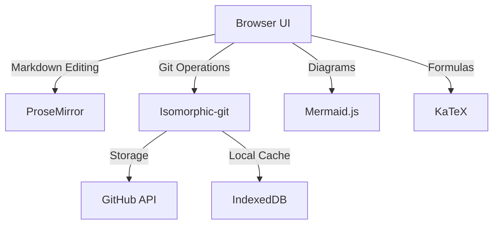
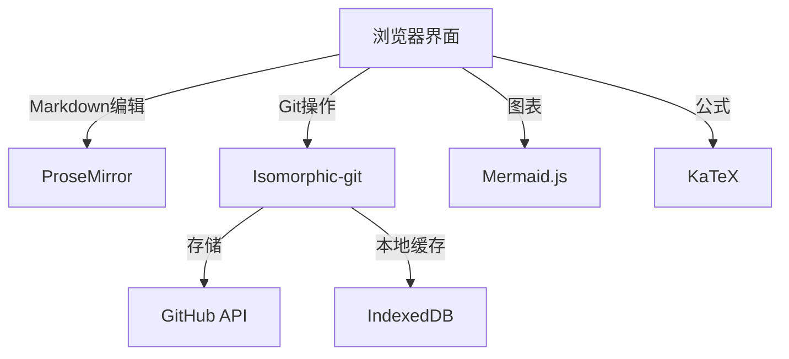

# GitNotepad - Cross-platform Markdown Editor with Git Storage

## Overview
GitNotepad is a web-based markdown editor that combines VS Code-like editing experience with git-based storage. It provides true WYSIWYG markdown editing while automatically versioning all changes through git integration.

## Core Features & Feasibility Analysis

### 1. VS Code-like WYSIWYG Markdown Editor
**Implementation**: Use [ProseMirror](https://prosemirror.net) or [CodeMirror](https://codemirror.net) with markdown extensions
**Feasibility**: High - Existing robust editor frameworks support markdown with live preview

### 2. Cross-platform Compatibility
**Implementation**: Responsive design using CSS Grid/Flexbox, touch event support
**Feasibility**: High - Modern web frameworks (React/Vue/Svelte) provide excellent cross-platform support

### 3. Git Storage Integration
**Implementation**:
- GitHub OAuth for authentication
- LocalStorage for session persistence
- [Isomorphic-git](https://isomorphic-git.org) for browser-based git operations
**Feasibility**: High - Existing libraries handle git operations in browser

### 4. Extended Markdown Support
**Implementation**:
- [Mermaid.js](https://mermaid.js.org) for diagrams
- [MathJax](https://www.mathjax.org) or [KaTeX](https://katex.org) for LaTeX
**Feasibility**: High - Mature libraries available

### 5. Lightweight Architecture
**Implementation**:
- Micro-framework (Preact/Svelte)
- CDN-hosted dependencies
- Service Workers for caching
**Feasibility**: High - Modern optimization techniques enable lightweight apps

## Technical Architecture


## Development Roadmap
1. **Core Editor**: Setup editor with live preview
2. **Git Integration**: Implement repository binding/commit/push
3. **Extended Syntax**: Add Mermaid and LaTeX support
4. **Responsive UI**: Mobile/desktop layouts
5. **Persistence**: LocalStorage for session management

## Getting Started
```bash
# Install dependencies
npm install

# Start development server
npm run dev

# Build for production
npm run build
```

## Contribution Guidelines
- Follow GitFlow workflow
- Write tests for new features
- Keep dependencies minimal

## Project Structure
gitnotepad/
├── public/
│   └── favicon.ico
├── src/
│   ├── index.html
│   ├── index.js          <-- main entry point
│   ├── auth.js           <-- GitHub OAuth Integration
│   ├── editor.js         <-- WYSIWYG editor
│   ├── git.js            <-- Git integration
│   ├── extensions/       <-- Markdown extensions
│   │   ├── mermaid.js
│   │   └── katex.js
│   ├── ui/               <-- Responsive UI & Persistence
│   │   ├── responsive.js
│   │   └── persistence.js
│   └── styles/
│       └── main.css
└── package.json

---

# GitNotepad - 基于Git存储的跨平台Markdown编辑器

## 概述
GitNotepad是一款基于网络的Markdown编辑器，结合了类似VS Code的编辑体验与基于Git的存储。它提供真正的所见即所得Markdown编辑功能，并通过Git集成自动版本控制所有更改。

## 核心功能与可行性分析

### 1. 类似VS Code的所见即所得Markdown编辑器
**实现方式**: 使用[ProseMirror](https://prosemirror.net)或[CodeMirror](https://codemirror.net)配合Markdown扩展
**可行性**: 高 - 现有的强大编辑器框架支持实时预览

### 2. 跨平台兼容性
**实现方式**: 使用CSS Grid/Flexbox的响应式设计，触摸事件支持
**可行性**: 高 - 现代网页框架（React/Vue/Svelte）提供出色的跨平台支持

### 3. Git存储集成
**实现方式**:
- GitHub OAuth用于身份验证
- LocalStorage用于会话持久化
- [Isomorphic-git](https://isomorphic-git.org)用于浏览器端的Git操作
**可行性**: 高 - 现有库可处理浏览器中的Git操作

### 4. 扩展Markdown支持
**实现方式**:
- [Mermaid.js](https://mermaid.js.org)用于图表
- [MathJax](https://www.mathjax.org)或[KaTeX](https://katex.org)用于LaTeX
**可行性**: 高 - 成熟的库已存在

### 5. 轻量级架构
**实现方式**:
- 微框架（Preact/Svelte）
- CDN托管依赖项
- 服务工作者用于缓存
**可行性**: 高 - 现代优化技术可实现轻量级应用

## 技术架构


## 开发路线图
1. **核心编辑器**: 搭建支持实时预览的编辑器
2. **Git集成**: 实现仓库绑定/提交/推送功能
3. **扩展语法**: 增加Mermaid和LaTeX支持
4. **响应式UI**: 移动端/桌面端布局
5. **持久化存储**: 使用LocalStorage进行会话管理

## 快速入门
```bash
# 安装依赖
npm install

# 启动开发服务器
npm run dev

# 构建生产版本
npm run build
```

## 贡献指南
- 遵循GitFlow工作流
- 为新功能编写测试
- 保持依赖项最少

## 项目结构
gitnotepad/
├── public/
│   └── favicon.ico
├── src/
│   ├── index.html
│   ├── index.js          <-- 主入口文件
│   ├── auth.js           <-- GitHub OAuth 集成
│   ├── editor.js         <-- 编辑器核心逻辑（ProseMirror 初始化）
│   ├── git.js            <-- Git 集成逻辑（Isomorphic-git + GitHub API）
│   ├── extensions/       <-- 扩展 Markdown 支持（Mermaid & KaTeX）
│   │   ├── mermaid.js
│   │   └── katex.js
│   ├── ui/               <-- 响应式 UI 与持久化存储
│   │   ├── responsive.js
│   │   └── persistence.js
│   └── styles/
│       └── main.css
└── package.json
